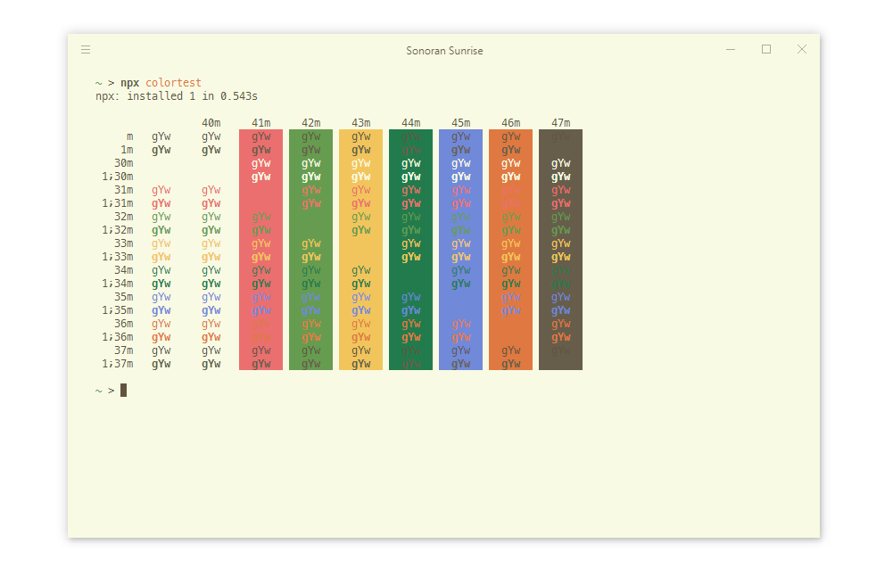

## Sonoran Sunrise

**Amuse-bouche**

Light, sandier shades punctuated by punchier sun-bleached accent colors. A color scheme for the Hyper terminal based off the SonoraBuild Minecraft server, 
with influence from Solarized Light.

**Appetizer**

MacOS Preview:

Windows 10 Preview:

**Main Course**

[Hyper](https://www.npmjs.com/package/hyper-sonoran-sunrise)

[VS Code (Soon to come...)](https://github.com/d-mckee/hyper-sonoran-sunrise)

**Dessert**

Credits to [Solarized (Light)](https://ethanschoonover.com/solarized/) by Ethan Schoonover for inspiration.

