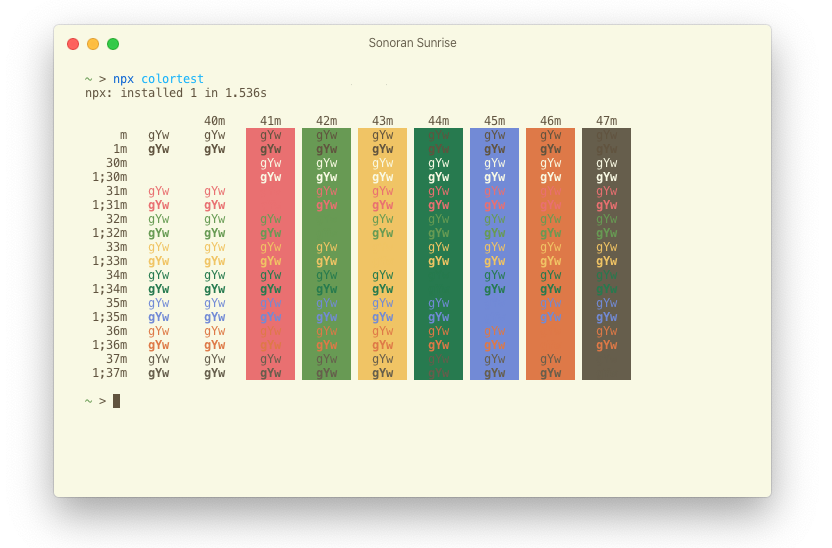

## Sonoran Sunrise

### Amuse-bouche

Light, sandier shades punctuated by punchier sun-bleached accent colors. A color scheme for the Hyper terminal based off the SonoraBuild Minecraft server, 
with influence from Solarized Light.

### Appetizer

### Main Course

**Package install (npm)**

[npm Package link](https://www.npmjs.com/package/hyper-sonoran-sunrise)

Open the Hyper preferences file (either through the context menu, or at `~/.config/Hyper/.hyper.js` on \*nix systems), go to `plugin: []`, and add 'hyper-sonoran-sunrise' like so: `plugin: ['hyper-sonoran-sunrise']`. Save the file and reload Hyper (if necessary).

**Manual install (local):**

Clone this repository to `~/.config/Hyper/.hyper_plugins/local/` on \*nix systems, or `C:\Users\<user>\AppData\Roaming\Hyper\.hyper_plugins\local\` on Windows systems, then reload Hyper (if necessary).

### Dessert

[VS Code Theme (Soon to come...)](https://github.com/d-mckee/hyper-sonoran-sunrise)

Credits to [Solarized (Light)](https://ethanschoonover.com/solarized/) by Ethan Schoonover for inspiration.

